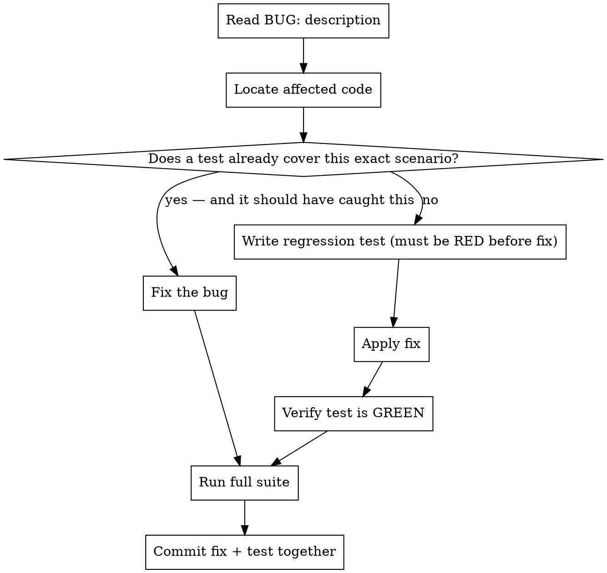

# Bug Fix With Coverage

## Core principle

A bug closed without a test is a bug waiting to come back. Every "BUG:" message ends with a test that would have caught it.

## Workflow



## Steps

**1. Understand and locate**
Read the BUG: message carefully. Find the file(s) and function(s) involved. If the root cause is unclear, use `superpowers:systematic-debugging` before touching any code.

**2. Check existing test coverage**
Search `tests/` for any test that exercises the exact failing scenario. Ask: *if this test existed, would it have gone RED when the bug was present?*

- If YES → the test exists but failed silently or wasn't catching the right thing. Fix both the bug and the test.
- If NO → write a regression test first (step 3).

**3. Write the regression test (RED)**
Write the narrowest possible test that reproduces the bug. Run it — it **must fail** before the fix. If it passes already, the test is wrong; rewrite it.

```python
# Example: test the exact broken behaviour, not a general smoke test
def test_bug_NNN_description_of_what_was_broken():
    result = the_function(inputs_that_triggered_the_bug)
    assert result == expected_correct_output
```

**4. Fix the bug**
Apply the minimal fix. Do not refactor unrelated code.

**5. Verify GREEN**
Run the regression test — it must now pass. If it still fails, the fix is incomplete.

**6. Run the full suite**
```bash
pytest tests/ -v
```
All tests must pass. A bug fix that breaks something else is not a fix.

**7. Commit fix + test together**
```
fix(<area>): <what was broken and how it's fixed>

Regression test added: test_<description> in tests/<file>.py
```

## What counts as "covering this scenario"

A test covers the scenario only if:
- It calls the same code path the bug lived in
- It would go **RED** on the unfixed code
- It asserts the specific output/behaviour that was wrong

A passing smoke test that happens to touch the file does **not** count.

## Red flags — stop and add a test

- "The fix is obvious, no test needed" → still need one
- "The existing tests pass, so it's fine" → they didn't catch it before; add a specific one
- "It's a one-liner fix" → one-liner bugs have one-liner tests
- "I'll add a test later" → later never comes; commit blocks until test exists

## Goal

Every "BUG:" that goes through this workflow leaves the codebase with:
1. The bug fixed
2. A test that proves it's fixed
3. CI that will catch any future regression automatically
